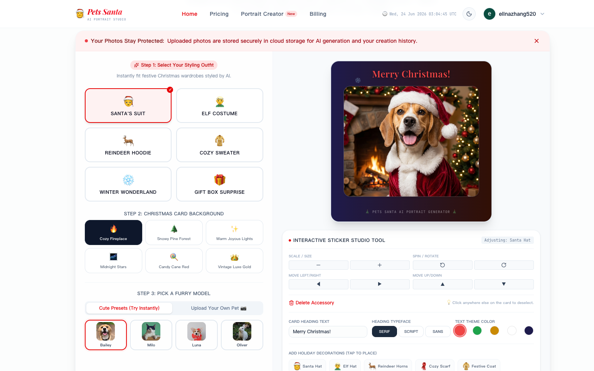
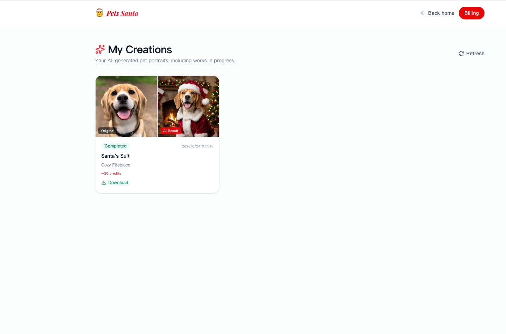
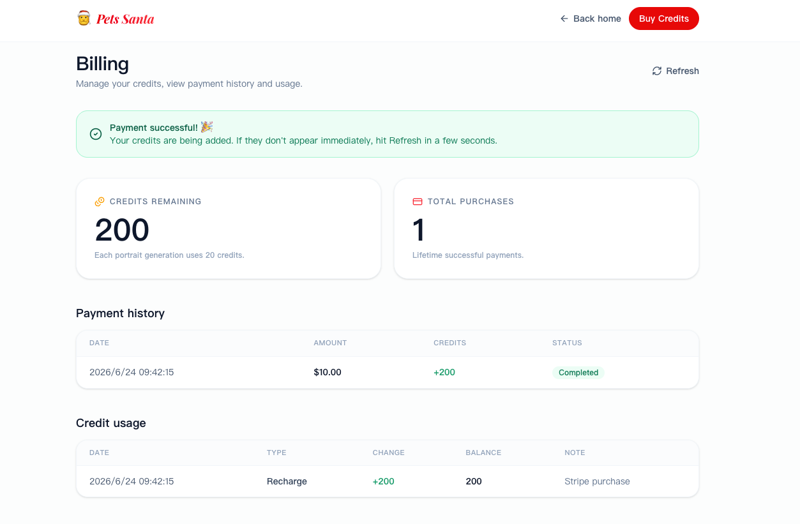

<div align="center">

# 🎅 Pets Santa — AI Pet Christmas Portrait Studio

**Turn your pet's photo into a magical Christmas portrait in seconds, powered by AI.**

[](https://nextjs.org/)
[](https://www.typescriptlang.org/)
[](./LICENSE)
[](./CONTRIBUTING.md)

[Live Demo](#) · [Report Bug](../../issues) · [Request Feature](../../issues) · [中文文档](./README_zh.md)

</div>

---

## 📖 Table of Contents

- [About](#about)
- [Screenshots](#screenshots)
- [Features](#features)
- [Tech Stack](#tech-stack)
- [Architecture](#architecture)
- [Getting Started](#getting-started)
- [Environment Variables](#environment-variables)
- [Project Structure](#project-structure)
- [Available Scripts](#available-scripts)
- [Deployment](#deployment)
- [Contributing](#contributing)
- [Security](#security)
- [License](#license)

---

## About

**Pets Santa** is a full-stack AI portrait studio that lets pet owners upload a photo of their dog, cat, or any furry friend and instantly generate festive, high-quality Christmas portraits — Santa suits, elf costumes, cozy fireplaces, snowy forests, and more — using generative AI.

The project is built end-to-end on the **Next.js App Router**, with real user authentication, a credit-based billing system backed by **Stripe**, persistent image storage via **Vercel Blob**, a **Supabase (PostgreSQL)** database managed through **Drizzle ORM**, and AI image generation powered by the **Kie.ai (Nano Banana Pro)** API.

> This repository is a great reference if you're building a production-style **AI SaaS** product: auth, credits, payments, async AI job processing, and a polished marketing landing page, all wired together.

---

## Screenshots

### Portrait Studio — Interactive sticker-style editor

Pick an outfit, a background, and a furry model (or upload your own pet), then fine-tune stickers, text, and decorations live on the canvas.



### My Creations — Before / After results

Every generation is saved to your personal gallery with an original-vs-AI-result comparison and one-click download.



### Billing — Transparent credit-based pricing

Track remaining credits, purchase history, and a full ledger of every credit earned and spent.



---

## Features

| Feature | Description |
| --- | --- |
| 🎨 **6 Christmas outfits** | Santa Suit, Elf Costume, Reindeer Hoodie, Cozy Sweater, Winter Wonderland, Gift Box Surprise |
| 🖼️ **6 holiday scenes** | Cozy fireplace, snowy forest, warm lights, starry night, candy-cane red, vintage gold |
| 🐶 **Flexible pet input** | Upload your own pet or try instant presets |
| ✨ **Interactive sticker studio** | Drag, scale, rotate, and place holiday accessories live on the canvas |
| ⚡ **Async AI generation pipeline** | Live polling and webhook callbacks for reliable task completion |
| 🔐 **Authentication** | Email/password and Google OAuth (Better Auth) |
| 💳 **Credit-based billing** | Stripe Checkout with signature-verified webhooks |
| 📦 **My Creations gallery** | Original vs. AI-result comparisons, saved per user |
| 🌗 **Light / dark theme** | Full theme support out of the box |
| 🔒 **Privacy-first** | Uploaded photos are stored securely and only used for generation |

---

## Tech Stack

| Layer | Technology |
| --- | --- |
| Framework | [Next.js 16](https://nextjs.org/) (App Router, Turbopack) |
| Language | TypeScript |
| UI | Tailwind CSS v4, [shadcn/ui](https://ui.shadcn.com/), Radix UI, [lucide-react](https://lucide.dev/) |
| Authentication | [Better Auth](https://www.better-auth.com/) (email/password + Google OAuth, username plugin) |
| Database | [Supabase](https://supabase.com/) (PostgreSQL) via [Drizzle ORM](https://orm.drizzle.team/) |
| File Storage | [Vercel Blob](https://vercel.com/docs/storage/vercel-blob) |
| Payments | [Stripe](https://stripe.com/) (Checkout Sessions + Webhooks) |
| AI Image Generation | [Kie.ai](https://kie.ai/) — Nano Banana Pro model |
| Forms & Validation | React Hook Form + Zod |
| Notifications | Sonner (toast) |

---

## Architecture

```
                       ┌──────────────────────┐
                       │     Browser / UI      │
                       │  Portrait Studio (Next)│
                       └──────────┬───────────┘
                                  │ 1. Upload photo
                                  ▼
                    /api/upload  ──────────────►  Vercel Blob
                                  │
                                  │ 2. Create generation task
                                  ▼
                    /api/generate ──────────────►  Kie.ai (Nano Banana Pro)
                                  │                       │
                                  │  3. Poll / callback    │
                                  ▼                       ▼
              /api/generate/[taskId]  ◄──────  /api/callback
                                  │
                                  ▼
                       Supabase (PostgreSQL via Drizzle)
                       - generation_task
                       - credit_transaction
                                  ▲
                                  │ Checkout & webhook
                                  │
                    /api/checkout ────────────►  Stripe Checkout
                    /api/webhook  ◄────────────  Stripe Webhook (signed)
```

1. The user uploads a pet photo, which is stored in **Vercel Blob**.
2. `/api/generate` validates the user's credit balance, builds a prompt, and creates an async task on **Kie.ai**.
3. The task is resolved either via **Kie.ai's callback** or by the client **polling** `/api/generate/[taskId]`.
4. Successful generations deduct credits and are persisted to **Supabase** through **Drizzle ORM**.
5. Credit top-ups go through **Stripe Checkout**; the **signed webhook** (`/api/webhook`) is the single source of truth that grants credits, guaranteeing idempotency even if Stripe retries delivery.

---

## Getting Started

### Prerequisites

- Node.js ≥ 18.18
- [pnpm](https://pnpm.io/) (recommended) or bun / npm
- A [Supabase](https://supabase.com/) project (PostgreSQL connection string)
- A [Stripe](https://stripe.com/) account (test mode is fine for local dev)
- A [Vercel Blob](https://vercel.com/docs/storage/vercel-blob) store / read-write token
- A [Kie.ai](https://kie.ai/) API key
- (Optional) Google OAuth credentials for social login

### 1. Clone the repository

```bash
git clone https://github.com/<your-username>/<your-repo>.git
cd <your-repo>
```

### 2. Install dependencies

```bash
pnpm install
# or: bun install / npm install
```

### 3. Configure environment variables

This project reads environment variables from **`.env.local`** (see [`drizzle.config.ts`](./drizzle.config.ts)). Create the file at the project root:

```bash
touch .env.local
```

See the [Environment Variables](#environment-variables) section below for the full list of required keys.

### 4. Set up the database

Push the Drizzle schema to your Supabase Postgres instance:

```bash
pnpm db:push
```

Or generate and run migrations instead:

```bash
pnpm db:generate
pnpm db:migrate
```

You can also open Drizzle Studio to inspect data visually:

```bash
pnpm db:studio
```

### 5. Run the development server

```bash
pnpm dev
```

Open [http://localhost:3000](http://localhost:3000) to see the app.

### 6. Configure webhooks (for local payment testing)

Use the [Stripe CLI](https://stripe.com/docs/stripe-cli) to forward events to your local server:

```bash
stripe listen --forward-to localhost:3000/api/webhook
```

Copy the printed signing secret into `STRIPE_WEBHOOK_SECRET`.

---

## Environment Variables

All variables are read from **`.env.local`** at the project root. Never commit this file.

| Variable | Description | Required |
| --- | --- | --- |
| `DATABASE_URL` | Supabase PostgreSQL connection string used by the app at runtime | ✅ |
| `DIRECT_URL` | Direct (non-pooled) Supabase Postgres connection string, used by Drizzle Kit for migrations | ✅ |
| `NEXT_PUBLIC_BASE_URL` | Public base URL of the deployment, e.g. `http://localhost:3000` or your production domain | ✅ |
| `GOOGLE_CLIENT_ID` | Google OAuth client ID for social login | Optional |
| `GOOGLE_CLIENT_SECRET` | Google OAuth client secret | Optional |
| `KIE_AI_API_KEY` | API key for [Kie.ai](https://kie.ai/api-key) (Nano Banana Pro image generation) | ✅ |
| `STRIPE_SECRET_KEY` | Stripe secret key (server-side) | ✅ |
| `STRIPE_WEBHOOK_SECRET` | Signing secret used to verify Stripe webhook events | ✅ |
| `PRICE_ID` | Stripe Price ID for the credit pack used at checkout | ✅ |
| `BLOB_READ_WRITE_TOKEN` | Vercel Blob read/write token for storing uploaded pet photos and generated portraits | ✅ |

> 💡 In production, `NEXT_PUBLIC_BASE_URL` is also used to build the Kie.ai callback URL (`/api/callback`) — make sure it points to a publicly reachable HTTPS domain.

---

## Project Structure

```
src/
├── app/
│   ├── (routes)/
│   │   ├── (auth)/          # Sign in / sign up pages
│   │   ├── (home)/          # Landing page
│   │   ├── billing/         # Billing & credit history
│   │   ├── creations/       # "My Creations" gallery
│   │   └── pricing/         # Pricing page
│   └── api/
│       ├── auth/[...all]/   # Better Auth handler
│       ├── billing/         # Credit & payment data
│       ├── callback/        # Kie.ai generation callback
│       ├── checkout/        # Stripe Checkout session creation
│       ├── creations/       # Creations list endpoint
│       ├── generate/        # Create & poll generation tasks
│       ├── upload/          # Vercel Blob photo upload
│       └── webhook/         # Stripe webhook handler (signed)
├── components/
│   ├── pets-santa/          # Landing page, Portrait Studio, pricing, etc.
│   └── ui/                  # shadcn/ui primitives
├── db/
│   ├── schema/               # Drizzle schema: auth, billing, generation
│   └── index.ts              # Drizzle client
├── lib/
│   ├── auth/                 # Better Auth client/server config
│   ├── billing/               # Stripe & credit logic
│   ├── generation/            # Generation task orchestration
│   └── kie/                   # Kie.ai API client & prompt builder
└── proxy.ts                   # Route protection middleware
```

---

## Available Scripts

| Command | Description |
| --- | --- |
| `pnpm dev` | Start the dev server with Turbopack |
| `pnpm build` | Build for production |
| `pnpm start` | Start the production server |
| `pnpm lint` | Run ESLint |
| `pnpm db:generate` | Generate Drizzle migration files |
| `pnpm db:migrate` | Apply migrations to the database |
| `pnpm db:push` | Push the schema directly to the database (no migration files) |
| `pnpm db:studio` | Open Drizzle Studio |

---

## Deployment

This project is designed to deploy seamlessly on **[Vercel](https://vercel.com/)**, since it natively uses **Vercel Blob** for storage.

1. Push your repository to GitHub.
2. Import the project on Vercel.
3. Add all variables from the [Environment Variables](#environment-variables) table to your Vercel project settings.
4. Set `NEXT_PUBLIC_BASE_URL` to your production domain.
5. Add a Stripe webhook endpoint pointing to `https://<your-domain>/api/webhook` and copy its signing secret into `STRIPE_WEBHOOK_SECRET`.
6. Deploy 🚀

---

## Contributing

Contributions, issues, and feature requests are welcome! Please read [CONTRIBUTING.md](./CONTRIBUTING.md) before opening a pull request, and make sure you follow our [Code of Conduct](./CODE_OF_CONDUCT.md).

## Security

If you discover a security vulnerability, please **do not** open a public issue. See [SECURITY.md](./SECURITY.md) for our responsible disclosure process.

## License

This project is licensed under the **MIT License** — see the [LICENSE](./LICENSE) file for details.

---

<div align="center">

Made with ❄️ and 🎄 for pet lovers everywhere.

</div>
